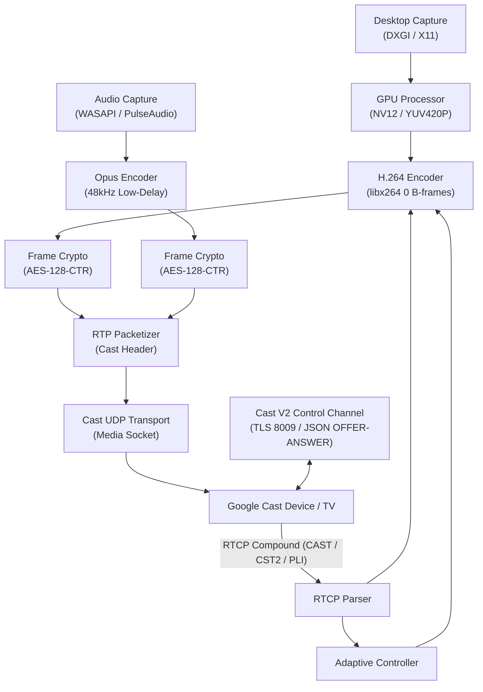

# CastMirror ⚡📺

Native, low-latency desktop display mirroring to Google Cast / Chromecast-compatible TVs with sub-200ms latency, dynamic bitrate adaptation, AES-128-CTR hardware encryption, and zero-click reconnect.

---

## 🌟 Features

- **Native C++20 Cast Core (`castcore`)**:
  - **Cast V2 Control Plane**: TLS on port 8009 with OpenSSL, virtual connection multiplexing, heartbeat ping/pong keepalive, app launch (`0F5096E8`), and teardown.
  - **Cast Streaming OFFER/ANSWER Protocol**: WebRTC mirroring JSON negotiation, dynamic AES key/IV generation, constraint negotiation, and UDP port binding.
  - **Cast UDP Media Transport**: Custom RTP packetizer with Cast 7-byte header, keyframe indexing, adaptive latency extensions, and MTU fragmentation.
  - **Compound RTCP Parser**: CAST feedback packet parsing, checkpoint frame ACKs, CST2 bitvector loss recovery, and Picture Loss Indicator (PLI) keyframe requests.
  - **AES-128-CTR Frame Crypto**: Low-overhead per-frame IV nonce derivation (`frame_id` at byte offset 8 XOR `cast_iv_mask`).
  - **Low-Latency Media Pipeline**:
    - **Display Capture**: Windows Desktop Duplication (DXGI) / Linux X11 native capture at up to 60fps.
    - **Audio Capture**: Windows WASAPI Loopback / Linux PulseAudio loopback at 48kHz stereo.
    - **Video Encoding**: Hardware-accelerated / Ultra-fast zero-latency H.264 / VP8 encoder via FFmpeg `libx264` (Annex-B NALUs, 0 B-frames, on-demand IDR keyframes).
    - **Audio Encoding**: Low-delay Opus encoder (`libopus`, 48kHz, 10ms frame packets).
  - **Adaptive Bitrate & Resolution Controller**: Dynamic ladder switching (4K60 -> 1080p60 -> 720p30) based on packet loss and RTT feedback.
  - **Clean & Fast Teardown**: Hard sub-500ms budget stop pipeline (measured ~93ms).

- **Frontends & Tools**:
  - **Interactive CLI (`app/castmirror`)**: One-click device picker, monitor selector, quality preset switch, and live stats HUD.
  - **PoC Test Suite (`tools/`)**:
    - `poc-control`: Control plane verification (TLS port 8009 + LAUNCH + STOP).
    - `poc-streaming`: Cast RTP/RTCP packet transport verification.
    - `poc-encode`: Capture -> H.264 & Opus encode performance benchmark (measured 9.7ms latency at 60fps).
    - `poc-join`: End-to-end capture + encode + Cast transport live test.
    - `fake-receiver`: Standalone simulated Chromecast receiver with TLS server and UDP media sink.
  - **WinUI 3 Modern Desktop App (`app/winui/`)**: Mica desktop UI blueprint with device discovery, preview, and telemetry drawer.
  - **CAF Fallback Receiver (`receiver-fallback/`)**: Custom Web Cast Receiver for compatibility fallback.

---

## 🏗️ Architecture Overview



---

## 🚀 Building & Running

### Prerequisites (Linux)
```bash
sudo apt update
sudo apt install -y build-essential cmake ninja-build protobuf-compiler libprotobuf-dev \
    libssl-dev libopus-dev libpulse-dev libx11-dev libxext-dev libxinerama-dev \
    libavcodec-dev libswscale-dev libavutil-dev nlohmann-json3-dev libgtest-dev
```

### Build Everything
```bash
mkdir -p build && cd build
cmake .. -G Ninja -DCMAKE_BUILD_TYPE=Release
ninja
```

### Run All Unit & Integration Tests (19 / 19 Tests)
```bash
cd build
ctest --output-on-failure
```
Output:
```
100% tests passed, 0 tests failed out of 19
Total Test time (real) = 9.49 sec
```

---

## 🖥️ Usage

### Interactive CLI
```bash
./build/app/castmirror
```

### CLI Command-Line Mode
```bash
# Cast to a specific device IP
./build/app/castmirror --device 192.168.1.150 --display 0 --preset High

# Cast display without audio
./build/app/castmirror --device 192.168.1.150 --no-audio
```

### Running Phase 0 Verification Tools
```bash
# Run 1080p60 capture & encode performance benchmark
./build/tools/poc-encode

# Run standalone simulated Chromecast receiver for offline testing
./build/tools/fake-receiver 28009 53533

# Run End-to-End join tool against fake receiver
./build/tools/poc-join 127.0.0.1 28009
```

---

## 📂 Project Structure

```
CastMirror/
├── app/
│   ├── cli/main.cc                     # Interactive command-line interface
│   ├── winui/                          # WinUI 3 Desktop Application blueprint
│   └── CMakeLists.txt
├── core/
│   ├── include/castcore/               # Public C++20 header interfaces
│   │   ├── adaptive_controller.h       # Dynamic bitrate / resolution adaptation ladder
│   │   ├── audio_capture.h             # WASAPI / PulseAudio / Synthetic audio capture
│   │   ├── audio_encoder.h             # Low-delay Opus audio encoder
│   │   ├── capability_model.h          # Device capability classifier (CC1/2/3/Ultra/GTV)
│   │   ├── cast_channel.h              # TLS 8009 Protobuf Cast V2 channel
│   │   ├── cast_engine.h               # Engine facade & API surface
│   │   ├── cast_session.h              # Live session orchestrator & pipeline
│   │   ├── cast_transport.h            # UDP RTP/RTCP transport & retransmit cache
│   │   ├── config.h                    # Configuration store & persistence
│   │   ├── device_discovery.h          # mDNS _googlecast._tcp discovery engine
│   │   ├── display_capture.h           # DXGI / X11 / Synthetic display capturer
│   │   ├── frame_crypto.h              # AES-128-CTR per-frame encryption
│   │   ├── gpu_processor.h             # Color conversion & scaling (BGRA -> YUV420P)
│   │   ├── logger.h                    # Thread-safe logging with ANSI colors
│   │   ├── mirroring_negotiator.h      # JSON OFFER/ANSWER builder & parser
│   │   ├── rtcp_parser.h               # RTCP CAST feedback & CST2 ACK bitvector
│   │   ├── rtp_packetizer.h            # Cast RTP packetizer & fragmentation
│   │   ├── session_recovery.h          # Reconnect policy & recovery timer
│   │   ├── state_machine.h             # State machine transition manager
│   │   ├── types.h                     # Core structs, enums, and constants
│   │   └── video_encoder.h             # Zero-latency H.264 / VP8 encoder
│   └── src/                            # Implementation files
├── docs/
│   └── ARCHITECTURE.md                 # Complete system design & specification
├── receiver-fallback/                  # Custom CAF Cast Web Receiver
├── tests/                              # Comprehensive Google Test suite (19 test cases)
└── tools/                              # PoC tools (poc-control, poc-streaming, poc-encode, poc-join, fake-receiver)
```

---

## 📜 License
Apache-2.0
