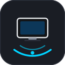
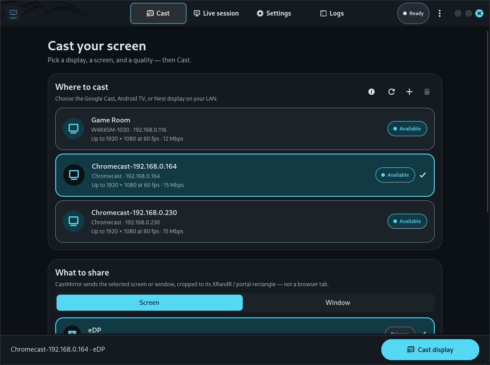
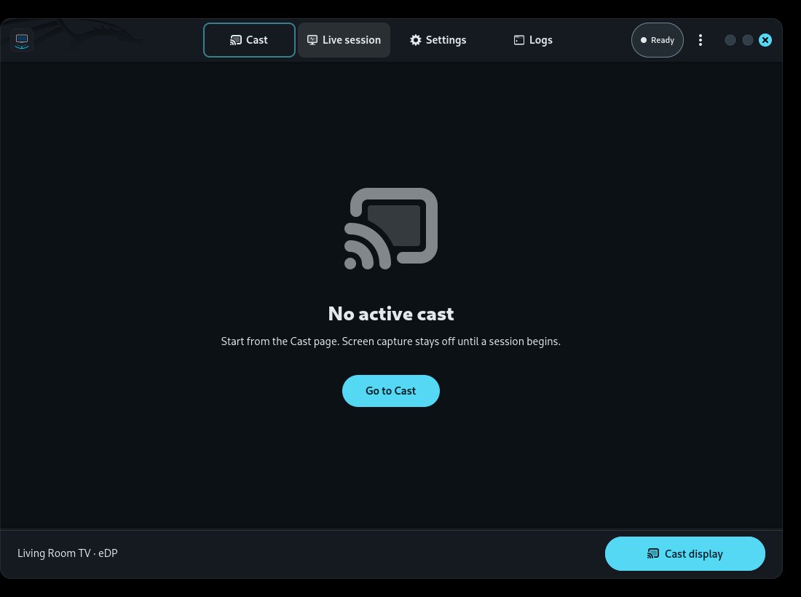
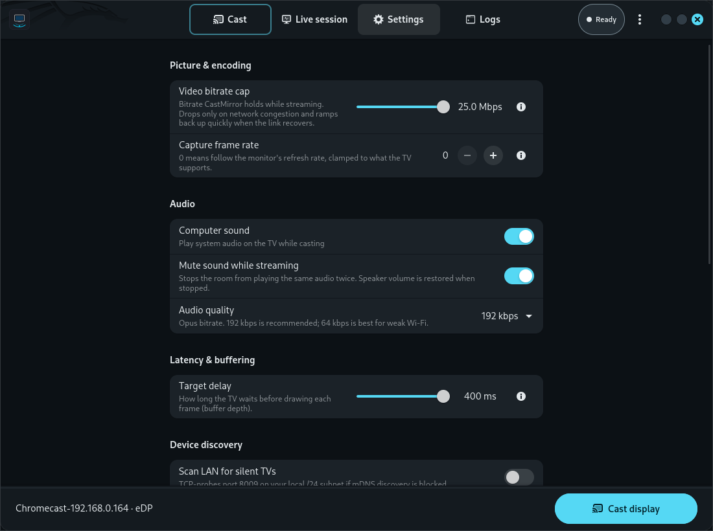
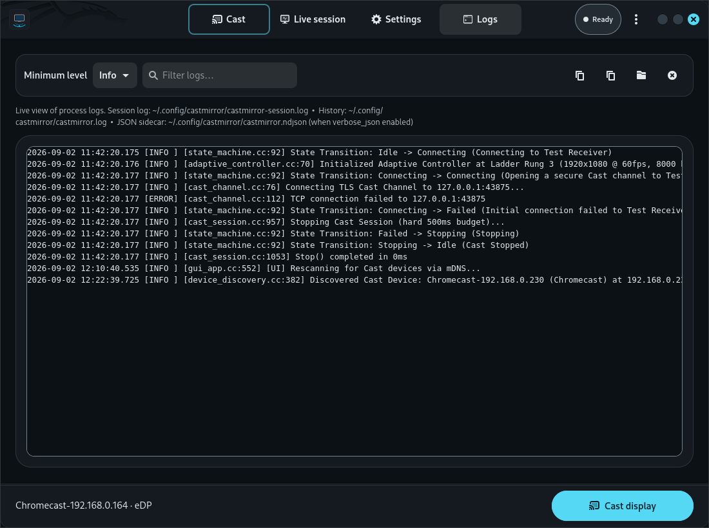
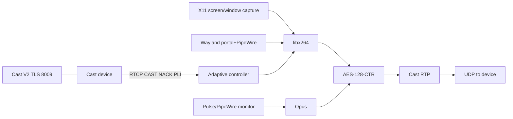

<p align="center">
  
</p>

<h1 align="center">CastMirror</h1>

<p align="center">
  Native Chromecast display mirroring.<br>
  Low latency. No Chrome.
</p>

<p align="center">
  <a href="https://github.com/vindeckyy/CastMirror/actions/workflows/ci.yml"></a>
  
  
  
  
  
</p>

<p align="center">
  
</p>

## What it is

CastMirror is a native **C++20** sender for Google Cast display mirroring. It discovers devices on the LAN, captures the Linux desktop and system audio, encodes **H.264** (libx264) and **Opus**, and streams **Cast RTP/RTCP** over UDP — the same media path Chrome uses for “Cast screen,” without embedding Chrome.

The shipping UI is a **GTK 4 + libadwaita** desktop app. A CLI is included.

## What it is not

- Not a Chrome / CEF wrapper
- Not Sunshine or Moonlight (those are ~20–50 ms game streams; Cast keeps a **playout delay**, about **200 ms** here)
- Not an HLS/DASH “fling” to the Default Media Receiver
- **Not affiliated with Google.** Chromecast, Google Cast, and Google TV are Google trademarks
- `app/winui/` is a **blueprint**, not the shipping Windows product

Official Cast sender SDKs cannot mirror a desktop. Chrome’s mirroring path is private as a product and open as a protocol. CastMirror implements that protocol as a LAN sender.

## Features

- One-click Cast to Chromecast, Google TV, and Cast TVs (or add a device by IP) with dynamic hardware model glyphs
- **Screen or window sharing** — cast an entire monitor or pick a single application window with application icon resolution. On Wayland the system portal picker handles selection; on X11 CastMirror enumerates and captures windows directly with XComposite redirection. On i3, sources on other workspaces remain selectable and keep rendering while you work elsewhere
- Quality presets **Auto / High / Balanced / Smooth** with an **inline bitrate slider** (1–25 Mbps) synchronized between Cast and Settings
- **Live studio controls** — Freeze display and Mute TV audio on the fly with clean silence-frame injection
- **Real-time vector sparklines** — Hardware-accelerated Cairo mini-charts for live FPS, bitrate, RTT, and packet loss
- Host speakers **mute** while audio is mirrored; previous mute state is restored on Stop
- **Adaptive bitrate is always on**: it holds your selected bitrate target, drops on congestion, and ramps back up aggressively once the link recovers
- **Appearance & Diagnostics** — System / Light / Dark theme switcher and built-in hardware/network self-test wizard
- AES-128-CTR per-frame media crypto as required by Cast Streaming
- TLS control plane on port **8009**
- Stop budget under **500 ms** (capture does not run except during a live session)

## Quick start (Linux)

```bash
sudo apt update
sudo apt install -y build-essential cmake ninja-build pkg-config protobuf-compiler libprotobuf-dev \
    libssl-dev libopus-dev libpulse-dev libx11-dev libxext-dev libxrandr-dev libxfixes-dev \
    libxcomposite-dev libxdamage-dev \
    libva-dev libavcodec-dev libswscale-dev libavutil-dev nlohmann-json3-dev libgtest-dev \
    libgtk-4-dev libadwaita-1-dev

cmake -S . -B build -G Ninja -DCMAKE_BUILD_TYPE=Release
cmake --build build -j"$(nproc)"

./build/app/castmirror-gui
./build/app/castmirror
```

Full package notes, firewall, and audio behavior: [docs/building.md](docs/building.md).

## Usage

The GUI is split into four dedicated tabs:

### 1. Cast
Discover LAN receivers, select a monitor display or open application window, tune target bitrate, and start mirroring.

<p align="center">
  
</p>

### 2. Live session
Real-time streaming pipeline visualization, hardware-accelerated Cairo vector sparkline charts (FPS, Bitrate, RTT, Packet Loss), dynamic adaptive ladder rungs, and live studio controls (Freeze display, Mute TV audio).

<p align="center">
  
</p>

### 3. Settings
Configure video encoding presets, target playout buffer delay, host audio mute behavior, color scheme theme (System default / Light / Dark), and run hardware/network self-test diagnostics.

<p align="center">
  
</p>

### 4. Logs
Live searchable diagnostic event logs with filter levels, quick copy, and open log directory actions.

<p align="center">
  
</p>

CLI:

```bash
# Cast a full display
./build/app/castmirror --device 192.168.1.150 --display 0 --preset High

# List available windows, then cast one
./build/app/castmirror --list-windows
./build/app/castmirror --device 192.168.1.150 --window 12345

# Audio-only
./build/app/castmirror --device 192.168.1.150 --no-audio
```

Desktop launcher: [app/io.github.vindeckyy.CastMirror.desktop](app/io.github.vindeckyy.CastMirror.desktop).

## Architecture



Details: [docs/ARCHITECTURE.md](docs/ARCHITECTURE.md), [docs/protocol.md](docs/protocol.md).

## Compatibility

Chromecast 3rd gen, Ultra, Google TV / Streamer, and built-in Cast TVs. **Nest Hub is 720p-class.** Matrix and preset table: [docs/COMPATIBILITY.md](docs/COMPATIBILITY.md).

## Project layout

```
CastMirror/
├── app/gui/                 # Shipping GTK 4 + libadwaita UI
├── app/cli/                 # Interactive / flag CLI
├── app/winui/               # Windows UI blueprint (not v1 shipping)
├── core/                    # castcore C++20 library
├── tests/                   # Google Test
├── tools/                   # poc-control, poc-streaming, poc-encode, poc-join, fake-receiver
├── docs/                    # Pages site + architecture / protocol / building
└── receiver-fallback/       # CAF research fallback, not the primary path
```

## Development

```bash
cd build && ctest --output-on-failure
./tests/castmirror_tests
./tools/poc-encode
./tools/fake-receiver 28009 53533
```

See [CONTRIBUTING.md](CONTRIBUTING.md). Historical lab notes: [docs/TEST_REPORT.md](docs/TEST_REPORT.md).

## Security

LAN-only. TLS to :8009. Media AES as the protocol requires. No cloud. Report privately: [SECURITY.md](SECURITY.md).

## License

Source in this repository is **Apache License 2.0** — see [LICENSE](LICENSE).

**Binaries linked against GPL libx264 generally must be treated as GPL.** Read [NOTICE](NOTICE) before you distribute builds.

## Disclaimer

CastMirror is an independent project. It is not affiliated with, endorsed by, or sponsored by Google LLC. It speaks a Chromium-compatible Cast Streaming protocol; firmware app IDs can change.
