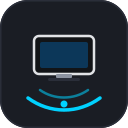
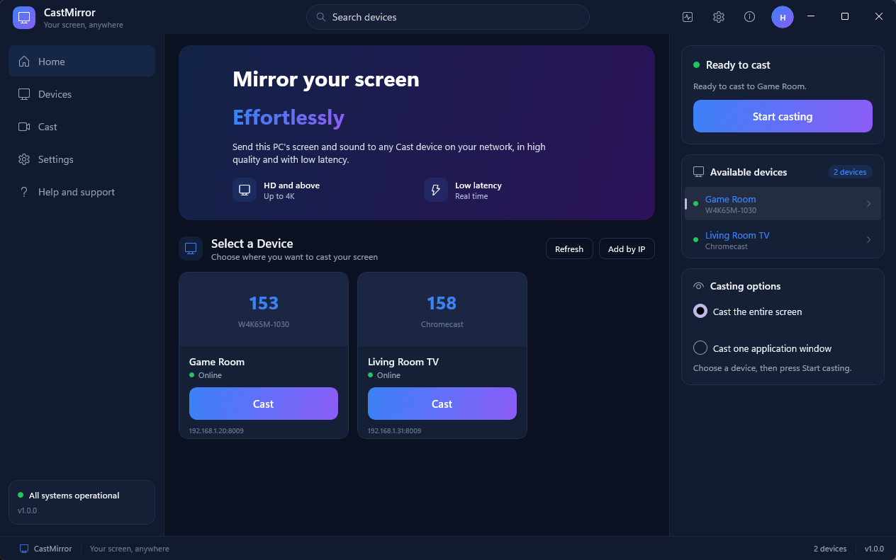

<p align="center">
  
</p>

<h1 align="center">CastMirror</h1>

<p align="center">
  Mirror your Windows PC to a Chromecast or Google TV.<br>
  Your whole screen or one window, with sound, and no Chrome.
</p>

<p align="center">
  <a href="https://github.com/vindeckyy/CastMirror/actions/workflows/ci.yml"></a>
  
  
</p>

<p align="center">
  
</p>

## Install

1. Download `CastMirror-Setup-<version>-x64.exe` from the [latest release](https://github.com/vindeckyy/CastMirror/releases/latest).
2. Run it. The installer adds a Start menu entry and a Windows Firewall rule for private and domain networks, so Windows doesn't stop discovery with a prompt.
3. Turn your TV on, put it on the same Wi-Fi as the PC, and open CastMirror.

A portable `CastMirror-win-x64.zip` is also on the release page. If you use it, run `scripts\setup_firewall.ps1` once from an elevated PowerShell, or allow CastMirror when Windows asks.

CastMirror needs Windows 10 version 2004 or later, 64-bit. Checksums for every download are in `SHA256SUMS-windows.txt`.

## Use it

1. Pick your TV from the list. If it doesn't appear, press **Rescan** (F5) or use **Add by IP**.
2. Pick what to share: a whole display or a single window.
3. Choose a quality preset and press **Cast display** (Ctrl+Enter).

While casting you can freeze the picture, mute the TV, and change the bitrate without restarting. Closing the window keeps the cast running in the tray. Quit from the tray icon.

| Preset | Use it for | Buffer |
|---|---|---|
| Auto | Most things. Starts at 1080p and adapts to your Wi-Fi. | 200 ms |
| High | A strong 5 GHz link and a TV that can take the bitrate. | 200 ms |
| Balanced | Everyday use over average Wi-Fi. | 200 ms |
| Smooth | Weak Wi-Fi. Drops to 720p. | 200 ms |
| Game | Lowest delay. Keeps resolution fixed. | 150 ms |
| Cinema | Video. Highest bitrate, deepest buffer. | 400 ms |

### Keyboard shortcuts

In the window: **Ctrl+Enter** start or stop, **F5** rescan, **Ctrl+,** settings, **Ctrl+L** logs.

Optional system-wide shortcuts (Settings, Desktop integration, Global shortcuts): **Ctrl+Alt+C** start or stop, **Ctrl+Alt+F** freeze, **Ctrl+Alt+M** mute the TV.

## What it does

- Discovers Cast devices over mDNS. If your router blocks mDNS, an opt-in subnet scan finds them directly.
- Captures a monitor with DXGI Desktop Duplication, or a single window through Windows.Graphics.Capture, at a steady 30 or 60 fps even when nothing on screen changes. Window capture shows the window's own content, so windows in front of it stay out of the picture. If a driver hands back HDR or 10-bit surfaces, they are converted to SDR.
- Captures system audio with WASAPI loopback, follows the default speakers when you switch to headphones, and folds 5.1 and 7.1 down to stereo. You can share one app's sound instead of everything (Settings, Audio, Share audio from), so notifications and other apps stay off the TV.
- Encodes H.264 on the GPU through Media Foundation and falls back to x264 on the CPU when the GPU encoder doesn't produce frames. Audio is Opus.
- Sends the same encrypted Cast RTP stream Chrome's "Cast screen" uses. The control connection is TLS on port 8009, and each device proves its identity against the Cast root certificates.
- Adapts bitrate and resolution to packet loss and round-trip time, and reconnects after a dropped connection, a sleep or a Wi-Fi change. You choose how long it keeps trying.
- Runs a single instance. Starting it again brings the running window forward.
- Optional: start hidden in the tray at sign-in, desktop notifications, light or dark theme.
- Speaks English, Spanish, German and French, following your Windows display language. The translations are unreviewed machine translations, so corrections are welcome. To try one, set `CASTMIRROR_LANG=de` before starting the app.

## Privacy

CastMirror talks to your TV over your local network and to nothing else. It has no telemetry and no account. It contacts GitHub only when you press **Check for updates** in About. Logs and settings stay in `%APPDATA%\CastMirror`. **Logs, Copy for bug report** masks the last part of every IP address before it reaches your clipboard.

## When something goes wrong

- **No devices found.** Check the PC and TV are on the same network, and that the network isn't a guest or "client isolation" network. Then try **Settings, Device discovery, Scan the network for TVs**.
- **Windows asked about the firewall.** Choose **Allow** for private networks. The installer normally does this for you.
- **The picture glitches or stutters.** Lower the preset to Balanced or Smooth, or turn on **Force software encode**.
- **CastMirror crashed.** It saves a crash file in `%APPDATA%\CastMirror\crashes` and tells you next launch. The file holds a copy of the program's memory, so share it only if you're comfortable with that.
- **Anything else.** Open **Logs**, press **Copy for bug report**, and paste it into an [issue](https://github.com/vindeckyy/CastMirror/issues).

## Build from source

Windows build steps, including the MSYS2 packages and the .NET SDK, are in [docs/building.md](docs/building.md). In short:

```bat
build-all.bat        :: native core + WinUI app
package.ps1          :: tests, self-contained publish, licence checks
```

Architecture notes are in [docs/ARCHITECTURE.md](docs/ARCHITECTURE.md), the Cast protocol details in [docs/protocol.md](docs/protocol.md), and device test results in [docs/DEVICE_MATRIX.md](docs/DEVICE_MATRIX.md). Contributions are welcome; see [CONTRIBUTING.md](CONTRIBUTING.md).

## What it isn't

- Not a Chrome or CEF wrapper.
- Not a game-streaming tool like Sunshine or Moonlight. Cast keeps a playout buffer, so expect about 150 to 400 ms of delay depending on the preset.
- Not affiliated with Google. Chromecast, Google Cast and Google TV are trademarks of Google LLC.

## Linux

The same `castcore` engine builds on Linux with a GTK 4 app and a CLI, but the Windows app is the primary product and Linux gets fixes rather than features. See [docs/building.md](docs/building.md).

## Licence

CastMirror's source is Apache-2.0 (see [LICENSE](LICENSE)). The Windows binaries include FFmpeg and libx264, which are GPL, so the download as a whole is distributed under the GPL. The details and the source offer are in [THIRD-PARTY-LICENSES.txt](THIRD-PARTY-LICENSES.txt).
