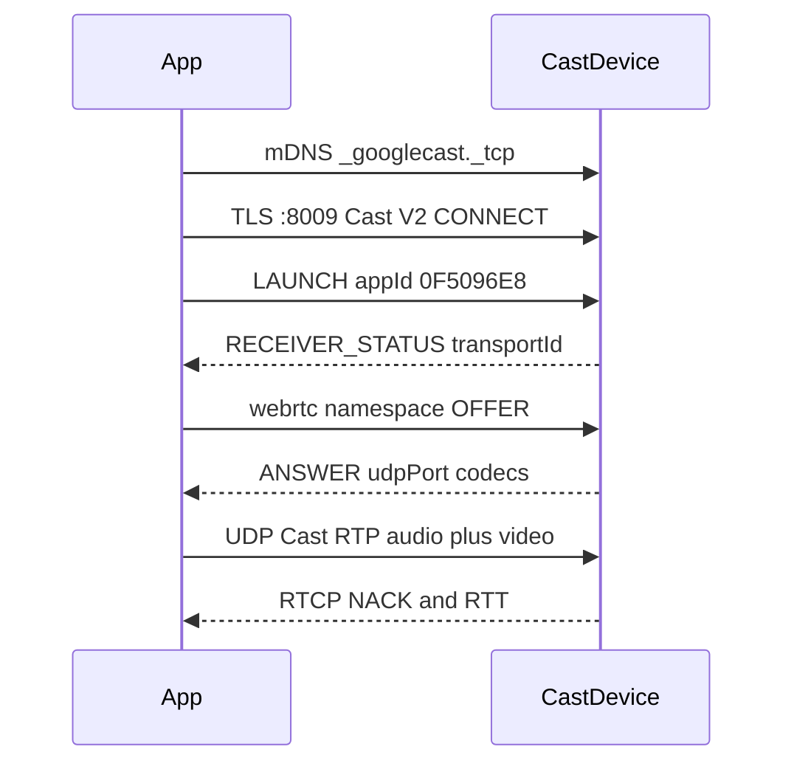
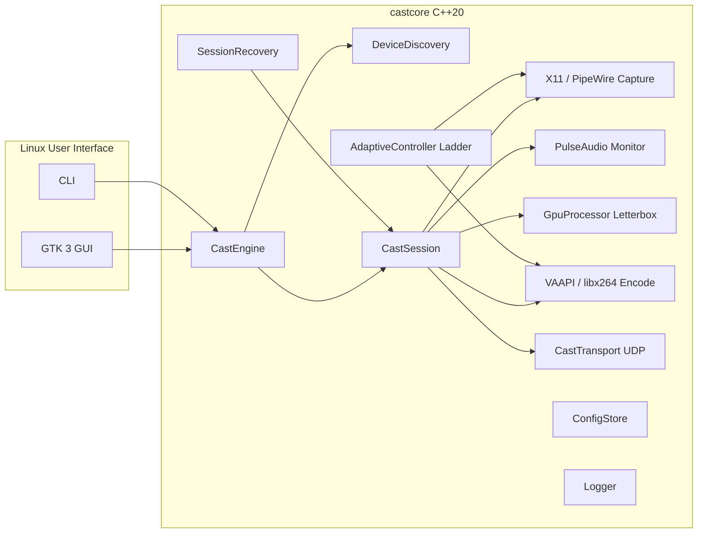

# CastMirror: Native Chromecast Display Mirroring

**Date:** 2026-08-26  
**Status:** Implemented — Linux GTK sender (`castmirror-gui`) and CLI (`castmirror`) on `castcore`. Windows WinUI remains a shell blueprint.  
**Working project name:** CastMirror

---

## 1. Product requirements and UX contract

**One-click loop:** open app → nearby TVs appear → select one (or use last TV) → **Cast Display** → desktop + optional system audio on the TV within seconds → **Stop** ends capture immediately.

**Non-goals for v1:** cloud relay, multi-room video groups, sending files/URLs/tabs, remote mouse/keyboard to the TV, HDR tone-mapping, DRM content (protected video will be black by OS design).

**Success bar (primary path, LAN, modern GPU):**

- Time from Cast click to first TV frame: **≤ 8 s** typical, **≤ 12 s** p95
- Glass-to-glass latency: **≤ 400 ms** typical (Chrome-class), **≤ 250 ms** on a clean 5 GHz LAN with `targetDelay` 200
- 1080p30 on all Cast video devices; 1080p60 on Chromecast 3rd gen and newer; 1440p/4K only when source, decoder, encoder, and network all allow it
- Capture **must not** run except while an active Cast session is streaming
- Stop must halt capture/encode/sockets within **500 ms**

**Honest latency ceiling:** this product should feel like Chrome’s “Cast screen”, not Sunshine/Moonlight (~20–50 ms). Cast receivers keep a **target playout delay** (Chrome default **400 ms**) so Wi-Fi retransmits do not freeze the picture. Do not promise game-streaming latency.

**Default user-visible quality control:** Auto / High / Balanced / Smooth, plus a per-preset video bitrate slider (locked while a session is live).

**Shipping v1 surface:** Linux **GTK 3** GUI (`app/gui`) and CLI (`app/cli`) on `castcore`. Capture is **X11** (XRandR per-monitor crop + MIT-SHM) or **Wayland** (xdg-desktop-portal ScreenCast + PipeWire); audio is **PulseAudio/PipeWire** sink monitor; video is **VAAPI H.264** hardware encode with **libx264** (`superfast`, `zerolatency`, High profile) software fallback. `app/winui/` is a UI blueprint for future Windows work.
---

## 2. How Chromecast display mirroring actually works

### Public Google APIs (not sufficient)

Official Cast Sender SDKs exist for **web, Android, and iOS only**. They can:

- Discover devices
- Launch a **registered Web Receiver**
- Load a media URL (HLS, DASH, Smooth, progressive HTTP)
- Send custom JSON messages

They **cannot** capture a Windows desktop or speak Chrome’s mirroring media path. There is **no** public “Cast my screen” API for native Windows apps. Android’s old **Remote Display** API is **deprecated/removed**.

HTTP “fling” (what pychromecast, catt, mkchromecast do) is a **media player**, not a mirror. Receiver buffering plus HLS/DASH/CMAF segmenting typically yields **1–8+ seconds**. That cannot meet the UX contract as the primary path.

### What Chrome actually does (private product, open protocol)

Chrome does **not** expose this to extensions or CEF as a stable API. Internally:

1. **Discovery:** mDNS/DNS-SD `_googlecast._tcp.local` (TXT: `id`, `fn`, `md`, `ca`, `st`, `ve`, …).
2. **Control:** TLS to port **8009** (Cast V2 / Cast Channel). Protobuf `CastMessage`. Namespaces include `urn:x-cast:com.google.cast.tp.connection`, `.heartbeat`, `.receiver`, `.deviceauth`.
3. **Launch firmware app** historically **`0F5096E8`** (“Chrome Mirroring”) and audio-only **`85CDB22F`**. **Re-read Chromium HEAD during PoC** — IDs and Android TV variants change.
4. **Session negotiation** on namespace **`urn:x-cast:com.google.cast.webrtc`** (name is misleading). JSON **OFFER / ANSWER**, not ICE/DTLS/SRTP WebRTC.
5. **Media:** **Cast Streaming** — custom RTP/RTCP over **UDP**, `rtpProfile: "cast"`, per-session **AES** keys in the offer (`aesKey`, `aesIvMask`), NACKs/retransmits, congestion control, **adaptive playout delay**. Implemented in Google’s **Open Screen `libcast`** and Chromium `//components/mirroring` + `//media/cast`.
6. **Offer example (from public protocol traces):** `castMode: "mirroring"`, audio `opus` 48 kHz, video `vp8` or `h264`, `targetDelay: 400`, resolutions, bitrates, SSRCs. Receiver returns `udpPort`, accepted `sendIndexes`, receiver SSRCs.

Device authentication (`urn:x-cast:com.google.cast.tp.deviceauth`) proves the dongle is a licensed Cast device (Google-provisioned cert chain). **Senders** may skip it (pychromecast does: TLS with `CERT_NONE`). Chrome verifies it. CastMirror should **implement verification** using Open Screen’s cert logic so users are not tricked by a fake receiver; it is not required for the dongle to accept a connection.

**Implication:** true mirroring outside Chrome is **technically realistic** by embedding **Open Screen (BSD-3-Clause)** and speaking the same control + Cast Streaming path. It is **not** available as a supported Google product SDK. Treat firmware app IDs and offer JSON as **Chromium-compatible protocol**, and **gate the product on a real-device PoC**.

---

## 3. Architecture options and choice

| Approach | Latency | Compatibility | Complexity | License / risk | Verdict |
|---|---|---|---|---|---|
| **A. Open Screen Cast Streaming to native mirroring app** | 200–400 ms | All Cast video devices Chrome can mirror to | High, but Google-owned code | BSD-3; app-ID / firmware drift | **Primary** |
| **B. Embed / automate Chrome** | Chrome-class | Excellent | Poor product (dependency, window, updates) | ToS / UX | Reject |
| **C. Extract Chromium Mirroring Service** | Chrome-class | Excellent | Extreme (Mojo, GPU process) | BSD | Reject — use libcast instead |
| **D. Local HTTP + Default/Styled Media Receiver** | 2–8 s | Excellent | Low | Public API | Last-resort only |
| **E. Custom CAF receiver + LL-CMAF/fMP4 HTTP** | ~1–3 s | Good (needs registered receiver + hosted HTTPS app) | Medium | Public API; static hosting only | **Fallback if A fails** |
| **F. Custom receiver + WebRTC** | ~200–600 ms on Google TV; poor on gen1/2 | Weak on old dongles; 1080p60 often unusable | High | Public receiver; native libwebrtc | Optional later for GTV-only |
| **G. Sunshine protocol to a Cast receiver** | Best latency | **Not Cast** | N/A | GPL | Reject |

**Selected architecture: A primary, E as compatibility-mode fallback, F not in v1.**

Why A: it is the **only** path that uses Cast’s firmware real-time pipeline (the TV is a Cast Streaming receiver, not an HTML5 player with multi-second buffers). Open Screen is Google’s implementation of that protocol, BSD-licensed, with `Sender` / `SenderSession` / OFFER-ANSWER. Why not E as primary: CAF live streaming is designed for broadcast TV, not desktop mirroring. Why not F in v1: extra stack, documented high-res failures on classic Chromecast, STUN/ICE complexity we do not need on LAN.

**If Phase 0 fails** (cannot launch mirroring app or ANSWER never arrives on real hardware): do not spend months reverse-engineering firmware. Pivot v1 to **E**, relabel latency as “Cast compatibility mode” (~1–2 s), and keep capture/encode modules unchanged.

---

## 4. Recommended system architecture

Linux-first **C++20 core** (`castcore`) + **GTK 3** desktop app (`castmirror-gui`) and CLI (`castmirror`). Core owns capture, encode, Cast V2 control, Cast RTP/RTCP transport, and session recovery. UI owns presentation and user intent.

**Pixel path (primary):** X11 XRandR / PipeWire portal capture → BGRA frame → `GpuProcessor` (fit-inside letterbox, NV12 / YUV420p direct write) → **H.264 encode** (VAAPI hardware MFT or libx264, 0 B-frames, low-delay) → Annex-B NALUs → `FrameCrypto` (AES-128-CTR) → `RtpPacketizer` (Cast RTP) → UDP to `answer.udpPort` → Cast device decode/render.

**Audio path:** PulseAudio / PipeWire default sink monitor loopback → PCM 48 kHz stereo (10 ms frames) → **libopus** (Opus 48 kHz stereo, ~192 kbps) → `FrameCrypto` → `RtpPacketizer` → UDP to same Cast receiver. Mute: default sink is muted during session, restored on Stop.

**Module boundaries:**

- `DeviceDiscovery` — mDNS `_googlecast._tcp` browse + optional subnet TCP probe
- `CastChannel` — TLS 1.2 Cast V2 (:8009), heartbeat PING/PONG, LAUNCH/STOP
- `MirroringNegotiator` — JSON OFFER/ANSWER, AES-128-CTR key exchange
- `IDisplayCapture` — `X11DisplayCapture` (XRandR crop + MIT-SHM) / `PipeWirePortalCapture` (portal ScreenCast) / `SyntheticDisplayCapture`
- `IAudioCapture` — `PulseAudioCapture` (libpulse monitor) / `SyntheticAudioCapture`
- `GpuProcessor` — libswscale direct-plane letterboxing (YUV420P / NV12)
- `IVideoEncoder` — `FFmpegVideoEncoder` (VAAPI `h264_vaapi` with `libx264` fallback, `Reconfigure`)
- `IAudioEncoder` — `OpusAudioEncoder` (libopus)
- `CastTransport` — UDP RTP transmission, RTCP feedback parser (NACK/PLI), retransmission cache, destination IP filter
- `AdaptiveController` — 8-rung ladder dynamically adjusting bitrate, resolution, and fps
- `SessionRecovery` — 30 s exponential backoff reconnection policy on network blips
- `ConfigStore` — `~/.config/castmirror/config.json`
- `Logger` — local rotating debug logs (`~/.config/castmirror/castmirror.log`)

## 5. Technology stack (and rejects)

**Core: C++20, MSVC, CMake, WIL, C++/WinRT for WGC.** Open Screen is C++; D3D11/NVENC/MF are C/C++. Rust would add a permanent FFI tax around libcast.

**UI: C# WinUI 3 + Windows App SDK, Mica, custom visual style (not stock Settings gray).** Tray via `Shell_NotifyIcon` (WinUI has no tray API). Unpackaged so capture/firewall/tray work.

**Rejected UIs:** Electron (RAM, extra process, no justification); Tauri (WebView2 around a GPU capture pipeline); Qt (LGPL/commercial + less native); Flutter (engine + weak tray); raw Slint for v1 (weaker Windows tray/accessibility — revisit for Linux).

**Reuse:**

- **openscreen** (BSD-3) — discovery optional, Cast channel, Cast Streaming **required**
- **libopus** (BSD)
- **OpenH264** (BSD) — software H.264, not GPL x264
- **FFmpeg** — **dynamic LGPL** only if needed for color/scale fallback; prefer D3D11 shaders
- Microsoft WGC / WASAPI loopback samples (MIT) as reference, not copy-paste of OBS/Sunshine (**GPL — do not link or paste**)

**Vendor encode:** NVENC SDK, AMF, Intel oneVPL as **optional** backends behind `IVideoEncoder`. Default probe order: **Media Foundation hardware MFT** (one path covers NV/AMD/Intel) → vendor SDK if MF latency too high → OpenH264.

**JSON:** offer messages — nlohmann/json or Open Screen’s own offer types (prefer library types, do not reimplement RTP).

---

## 6. Discovery and Cast session lifecycle

**Discovery:** continuous mDNS browse of `_googlecast._tcp`. Parse `fn`, `id` (UUID), `md`, `ca`. Filter **display-capable** sinks (exclude audio-only Home/Nest Mini/Chromecast Audio). Cast **groups** out of v1.

Maintain: `Online`, `Idle`, `Busy` (another app casting), `Unavailable`. Do not require IP entry. Cache last UUID; if IP changes, rediscover by UUID.

**Windows network:** if profile is Public, show a single explanation (mDNS often blocked) + “Switch to Private network” guidance. Request **private** firewall exception for outbound 8009 + UDP media + inbound RTCP.

**Connect sequence:**

1. User Cast (or tray one-click last device)
2. State: `Connecting` (progress, cancellable)
3. TLS Cast channel + heartbeat
4. `LAUNCH` mirroring app; wait `RECEIVER_STATUS` / transport id (timeout **8 s**)
5. Build OFFER: Opus + H.264 (and VP8 if encoder exists), resolutions from capability model, `targetDelay` 200 or 400, fresh AES keys
6. Wait ANSWER (timeout **5 s**)
7. Bind UDP, start capture/encode **only now**
8. State: `Casting`
9. Stop: stop capture first, then `STOP` app, close sockets, drop keys

**Defaults:** last TV, last display, audio on, quality Auto, `targetDelay` 400 until network looks clean then 200.

---

## 7. Capture, GPU, encode, adapt

**Display capture:**
- **X11 (default on X11):** `X11DisplayCapture` uses XRandR to enumerate monitors and crops to the selected display's geometry. Fast path uses MIT-SHM (`XShmGetImage`) with fallback to cropped `XGetImage`. Hardware cursor is composited via XFixes.
- **Wayland (default under Wayland):** `PipeWirePortalCapture` uses `xdg-desktop-portal` ScreenCast to allow the user to select any monitor/window, streaming via PipeWire (`pw_stream`) in BGRA.

**GPU / Color conversion:**
- `GpuProcessor` letterboxes the source into the target encode resolution: scales down to fit, never upscales or stretches, and pads black bars (16/128/128) around the active area.
- Writes directly into `AVFrame` linesized planes with 0 intermediate temporary memory copies.

**Codec policy:**
- **H.264 High profile, 0 B-frames, low delay** is the primary video path.
- **VAAPI hardware acceleration (`h264_vaapi`)** is probed on session start and used when GPU/driver support exists.
- **libx264** software encoding (`superfast`, `zerolatency`, High profile) is the universal fallback when VAAPI is unavailable or disabled via `CASTMIRROR_FORCE_SOFTWARE_ENCODE=1`.
- **Opus 48 kHz stereo (10 ms frames)** is the audio codec for Cast Streaming.

**Adapt:**
- Dynamic 8-rung adaptation ladder driven by RTCP loss and RTT:
  4K60 → 4K30 → 1440p60 → 1080p60 → 1080p30 → 720p60 → 720p30 → 540p30
- Step downs reconfigure the encoder on the fly (`Reconfigure`) and update capture target framerate, never exceeding initial maximum dimensions.

## 8. Network / streaming

- Media: **UDP Cast Streaming only** on primary path (no TCP media, no Nagle)
- Encryption: session AES from OFFER (local network confidentiality, not DRM)
- No TURN/cloud
- Congestion: `SenderPacketRouter` pacing
- RTCP: retransmit; size sender in-flight from RTT (Open Screen already doing this)
- HTTP fallback: local bind `0.0.0.0:ephemeral`, fMP4/CMAF or MPEG-TS, CORS `*`, `streamType: LIVE`, tiny segments; receiver HTML hosted on **HTTPS public URL** (Cast requirement); **media** URL is LAN `http://pc-ip:port/...`

---

## 9. UI/UX and application state

**Visual:** one stage, not a control panel. Large live source preview (bezel), TV tiles (name + Ready/Busy/Offline), one primary button. Fluent + custom type/spacing (Linear/Arc density, Microsoft materials). Dark default.

**Button:** `Cast Display` → spinner `Connecting to Living Room…` → `Stop Casting` (destructive, always visible). Connected: LIVE badge on preview, discreet stats **hidden by default** (click to expand: fps, bitrate, RTT, resolution).

**States to design explicitly:** empty LAN, searching, ready, connecting, casting, reconnecting, failed (with retry), device vanished, weak network (quality dropped), encoder failed, permission denied (capture/mic not needed; capture is graphics).

**Advanced (drawer):** source (display/window), quality preset, audio toggle, stats, DXGI vs WGC, start in tray. Never codecs/ports.

**Tray:** icon chroma when casting. Left-click: toggle last TV. Right-click: device list, open window, quit. First run shows the window; after one successful cast, optional start-in-tray.

**Privacy UX:** OS capture border when present + tray + in-app LIVE + optional floating “Casting to X” chip. Stopping is one click from tray.

**State machine:** `Idle → Discovering → Ready → Connecting → Negotiating → Streaming ⇄ Reconnecting → Stopping → Idle`, plus `Failed`. UI binds to this only.

---

## 10. Performance budget (where latency lives)

Aim **≤ 400 ms** end-to-end with `targetDelay=400`; tighter only when RTCP is clean.

- Capture wait: 0–16 ms — do not add extra vsync wait
- Copies: **0 extra** GPU copies beyond NV12 convert
- Encode: NVENC ~1–8 ms; MF ~8–20 ms; OpenH264 tens of ms (drop fps)
- Send buffer: ~0 — hand frame to libcast immediately
- Network: LAN 1–10 ms
- **Receiver jitter buffer: 150–400 ms — dominant and intentional**
- Decode/render: 8–32 ms

Measure glass-to-glass with a phone filming a millisecond stopwatch on the PC and the TV.

CPU/GPU targets at 1080p60 HW encode: **CPU < 15%** of one modern desktop, encode GPU **< 10%**.

---

## 11. Device compatibility

Use `md` + Chromium tables, then **ANSWER** as source of truth.

- **CC1/CC2:** 1080p30 or 720p60 H.264 HP L4.1; VP8 same limits
- **CC3:** 1080p60 H.264 L4.2
- **Ultra:** 1080p60 H.264; 4K via VP9/HEVC (v2)
- **CCwGTV / many Cast TVs:** 4K30 H.264; 4K60 HEVC/VP9
- **Google TV Streamer:** + AV1 (ignore in v1)
- **Nest Hub:** 720p; include as Cast display
- **Android TV Cast Connect:** extra app IDs — PoC against at least one Google TV

HDR sources: tone-map to SDR in the compute shader for v1 (no HDR pipeline).

---

## 12. Security and privacy

- Capture only in `Streaming`/`Reconnecting`
- No cloud media path
- TLS on Cast control; AES on media
- Verify device auth certs when Open Screen APIs allow
- Firewall: private LAN only
- Config stores device UUID/name, not screen contents
- Crash: terminate capture in a `finally` / unhandled-exception hook
- Protected content (HDCP): WGC/DDA yield black frames — show a one-time tip, do not try to bypass

Receiver HTML fallback requires Google Cast Developer Console ($5) and a public HTTPS origin for the **app**, not for desktop pixels.

---

## 13. Reliability

| Event | Behavior |
|---|---|
| Wi-Fi blip | `Reconnecting`, keep UI, retry channel + OFFER up to 30 s, then fail |
| Receiver reboot | Rediscover UUID, relaunch app |
| PC sleep/wake | Stop capture on sleep; full new session on wake if user still “casting” |
| IP change | Rediscover by UUID |
| Device gone | 5 s grace, then failed with “TV disappeared” |
| Encoder crash | Restart encoder; if 3 failures, stop session |
| Congestion | AdaptiveController downshift; raise `targetDelay` to 400 |
| Packet loss | libcast NACK; if persistent, drop fps/bitrate |
| Resolution change | Recreate capture pool + IDR; renegotiate if size class changes |
| Monitor unplug | Switch or stop |
| App crash | OS releases WGC; next launch Idle |
| Launch fail | User-visible error + retry; optional fallback path |

Heartbeat miss → reconnect. Never leave a zombie capture.

---

## 14. Testing strategy

- **Unit:** TXT parser, capability matrix, bitrate ladder, state machine, config, offer builder (golden JSON)
- **Integration:** Open Screen `cast_receiver` loopback (no TV)
- **Network:** `clumsy` / WinDivert — 2% loss, 50 ms jitter, reorder
- **Perf:** ETW + glass-to-glass stopwatch; GPUView if copies suspected
- **Real devices (minimum matrix):** Chromecast 2 or 3, Ultra or CCwGTV, one Cast-enabled TV, one Nest Hub if available
- **Soak:** 2 h 1080p60; sleep/wake; display mode change
- **UI:** WinAppDriver or FlaUI for Cast/Stop/tray; manual visual pass

Do not claim success without a **real-device** log of OFFER/ANSWER + measured latency.

---

## 15. Risks and pre-architecture PoCs

Do **not** build UI, tray, or settings before these pass.

**PoC 0A — Control plane (2–3 days):** mDNS list; TLS 8009; LAUNCH `0F5096E8` (or Chromium HEAD ID); confirm app name/status on TV.

**PoC 0B — Cast Streaming (3–5 days):** Open Screen sender + file or colorbar; complete webrtc OFFER/ANSWER; UDP; picture on **real** Chromecast. Measure latency.

**PoC 0C — Windows encode (2–3 days):** WGC → NV12 → MF/NVENC 1080p60; record bitrate, encode time, copies (PIX/GPUView). No Cast.

**PoC 0D — Join (3–5 days):** live desktop + Opus loopback through 0B. Acceptance: 1080p30 + audio, ≤ 400 ms, start ≤ 8 s.

**PoC 0E — only if 0A/0B fail:** CAF custom receiver + local fMP4; measure floor latency. If ≥ 2 s, product positioning must change.

**Kill criteria:** 0A/0B fail on two device generations after Chromium-matching offers → pivot to E. 0C cannot HW-encode on a mid-range iGPU at 1080p30 → still ship software 720p30 with clear quality limits.

Other risks: Open Screen Windows platform gaps (implement `platform/` hooks); WGC yellow border; MF encoder extra latency vs NVENC; ToS around built-in app IDs (use Open Screen + Chromium-compatible behavior; legal review before commercial ship).

---

## 16. Development roadmap

Each phase has a hard gate. UI polish is **Phase 4+**.

**Phase 0 — Validate Cast Streaming (gate)**  
Exists: poc tools, logs, latency number, go/no-go.  
Accept: live or file stream on a physical Cast device via native mirroring path.

**Phase 1 — `castcore` skeleton**  
Exists: interfaces, state machine, config, logging, fake transport.  
Accept: unit tests green; no UI.

**Phase 2 — Discovery + session**  
Exists: real mDNS, launch, OFFER/ANSWER, Stop.  
Accept: connect ≤ 8 s; cancel works; busy device surfaced.

**Phase 3 — Live pipeline**  
Exists: WGC, GPU NV12, HW H.264, Opus, libcast send.  
Accept: 1080p30+audio ≤ 400 ms; CPU/GPU budgets; Stop ≤ 500 ms; no capture when idle.

**Phase 4 — Recovery + adapt**  
Exists: reconnect, sleep, NIC, monitor loss, ladder, 60 fps where capable.  
Accept: 5 s Wi-Fi recovery; wake re-casts if still requested; downshift on loss.

**Phase 5 — Product UI + tray**  
Exists: designed main window, all states, last-TV one-click, settings drawer, LIVE privacy chrome.  
Accept: first-run to TV without jargon; tray toggle; a11y name on Cast button.

**Phase 6 — Compatibility + hardening**  
Exists: device matrix report; optional HTTP fallback if needed; installer/firewall; crash capture stop.  
Accept: matrix 1080p30 all video Casts tested; documented 4K/60 support list.

---

## Implementation notes for the next agent

- Vendor Open Screen as a **pinned commit**; build with GN/Ninja; consume as a CMake `IMPORTED` lib. Implement any missing Windows `platform/` hooks rather than forking protocol code.
- Resolve mirroring **app IDs** from current `cast_media_source.cc` / mirroring host in Chromium, not from 2018 blog posts alone.
- Prefer Open Screen `Offer`/`Answer` types over hand-rolled JSON if they serialize to the webrtc namespace format devices expect; if not, golden-test against a Chrome netlog OFFER.
- Encoder output must match what Cast Streaming expects (typically **Annex-B** H.264 with timestamps in the Cast timebase, often 1/90000 video, 1/48000 audio).
- Never start WGC in the UI process for thumbs **and** a second full-rate capture without a clear budget; thumbs at 5–10 fps, full-rate only while `Streaming`.
